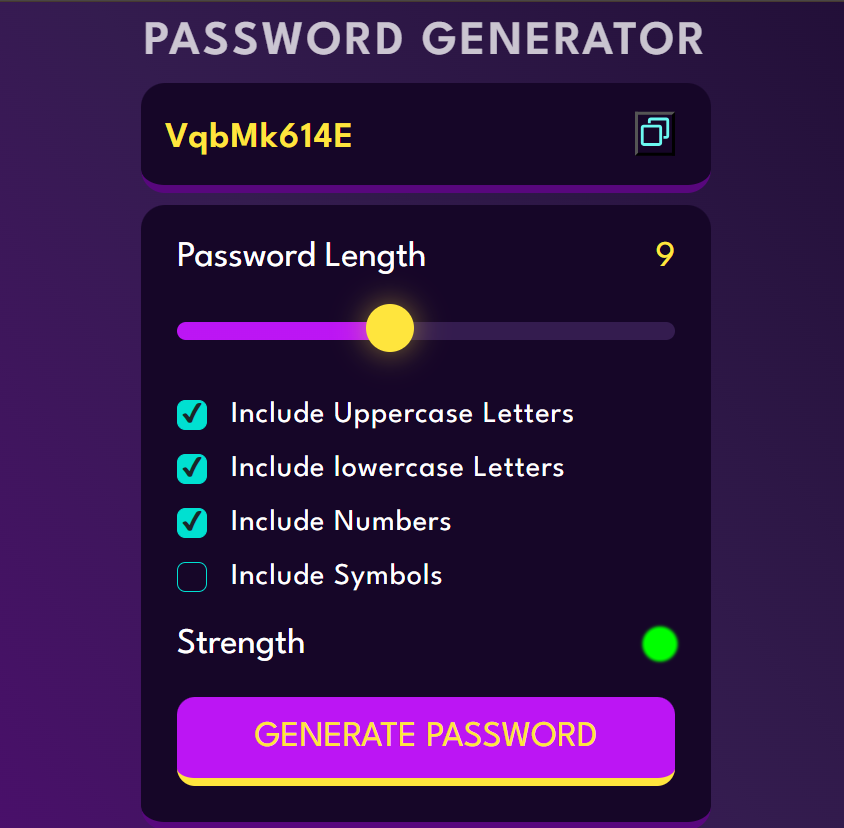

# Password Generator

Welcome to the Password Generator project! This web application generates strong and secure passwords based on user-selected criteria, ensuring that your passwords are both unique and robust.

## Features

- **Password Length**: Customize the length of your password.
- **Character Types**: Include uppercase letters, lowercase letters, numbers, and symbols.
- **Strength Indicator**: Visual representation of the password strength.
- **Copy to Clipboard**: Easily copy the generated password with a single click.

## How to Use

1. **Set Password Length**: Use the slider to choose the desired password length.
2. **Select Character Types**: Check the boxes to include uppercase letters, lowercase letters, numbers, and symbols.
3. **Generate Password**: Click the "Generate Password" button to create a new password.
4. **Copy Password**: Click the copy icon next to the password field to copy the generated password to your clipboard.

## Demo

## Technologies Used

- HTML5
- CSS3
- JavaScript

## Contributing

Contributions are welcome! Please fork the repository and create a pull request with your changes.

## Acknowledgements

- Fonts provided by [Google Fonts](https://fonts.google.com/).
- Icons from [Your Icon Source].

## Contact

If you have any questions or suggestions, feel free to open an issue or contact me at [your-email@example.com].

---

Feel free to customize this README with your specific details and make any adjustments needed. If you have any other requests or need further assistance, just let me know!
